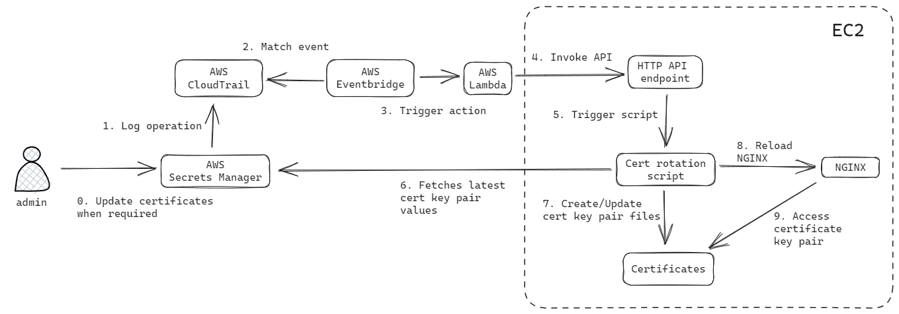

# NGINX Certificate Rotation Automation on AWS

Terraform project to deploy an example of certificate rotation automation for NGINX instances deployed on AWS.



To deploy, run
```
terraform init -upgrade
terraform apply -auto-approve
```
